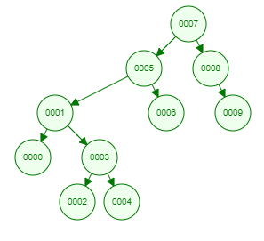

# [7, 5, 1, 8, 3, 6, 0, 9, 4, 2] dizisinin Binary-Search-Tree aşamalarını yazınız.

# *Her bir adımda eklenen eklenen deger bir önceki deger ile karşılaştırışır eğer büyük ise sağına küçük ise soluna doğru dallanır.*

